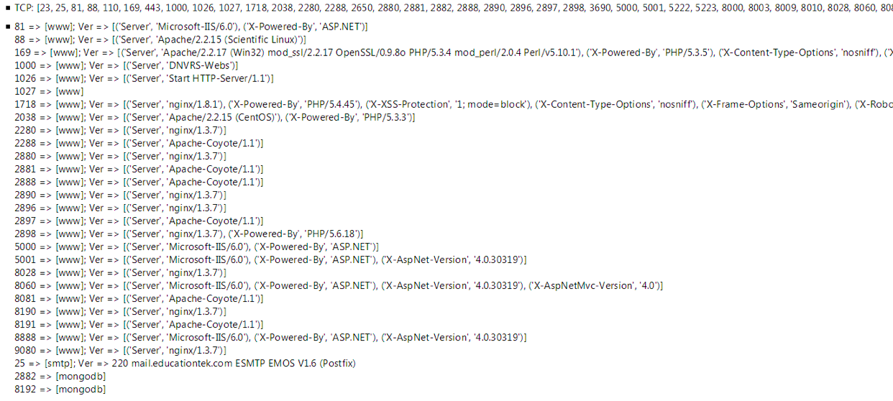
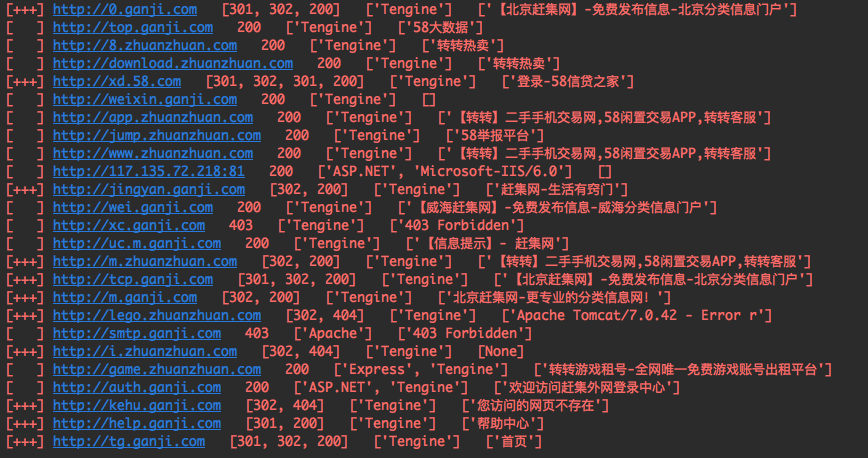

# Auth_domain 域名验证工具

写这个脚本的初衷是想模仿bugscan的一个端口指纹识别功能，看图:)：


基本的端口扫描和端口指纹识别(www,smtp,mongodb,...)、Banner识别(Http响应中的Server,X-Powered-By,...)，这些功能都挺有用的。

端口扫描部分自己也写好了，纯粹的socket实现，但还是感觉没有masscan加nmap好用
masscan可以扫全端口：sudo masscan 11.22.33.44 -p1-65535
nma指定开放端口识别Banner：sudo nmap -A --script=banner -p T:21,22,23,25,53,80,111,139,161,389,443 11.22.33.44

接着依葫芦画瓢实现了一个可以获取域名响应码、Banner(Server、X-Powered-By)、网页TITLE的脚本:


#### 几种子域名收集方式：
```
1. https://github.com/lijiejie/subDomainsBrute
2. https://github.com/Chora10/FuzzDomain
3. 法师的Layer子域名挖掘机
```
将整理后的子域名存放在url.txt文件中。

#### 输出主要分三部分：

* 状态码：如果有多个验证码，代表访问该域名所经过的所有跳转后的状态码，比如 http://jingyan.ganji.com => [302, 200] 就经过了一次临时跳转才停止，使用$ curl -I http://jingyan.ganji.com -L也可以看到整个跳转过程：
* Banner信息就简单了，就是获取Response中的HTTP 头中对应的值。
* 网页TITLE。

```
$ curl -I http://jingyan.ganji.com -L
HTTP/1.1 302 Found
Server: Tengine
Date: Thu, 22 Feb 2018 17:42:21 GMT
Content-Type: text/html; charset=UTF-8
Connection: keep-alive
Cache-Control: private, must-revalidate
Location: http://jingyan.ganji.com/pc/shouye
expires: -1

HTTP/1.1 200 OK
Server: Tengine
Date: Thu, 22 Feb 2018 17:42:21 GMT
Content-Type: text/html; charset=UTF-8
Connection: keep-alive
Vary: Accept-Encoding
Cache-Control: private, must-revalidate
```

2018-02-25 00:47:27
